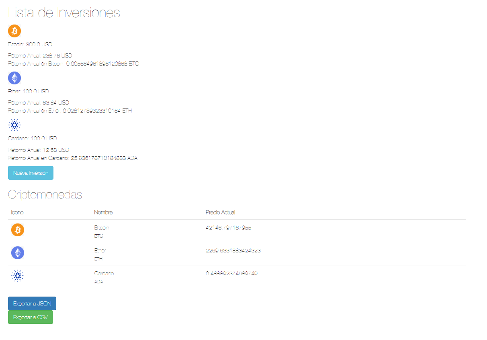
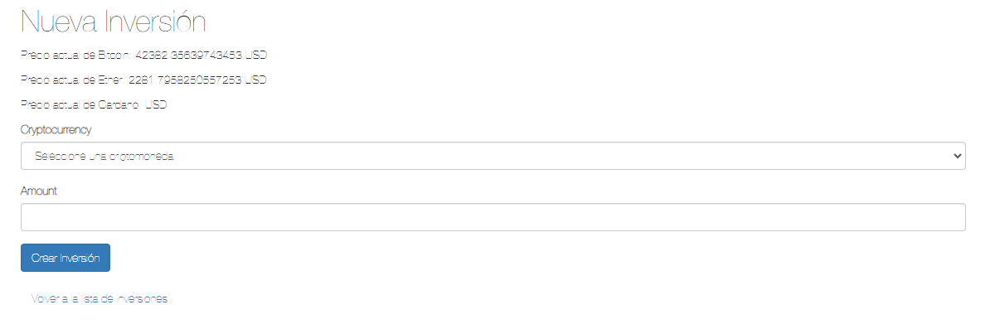
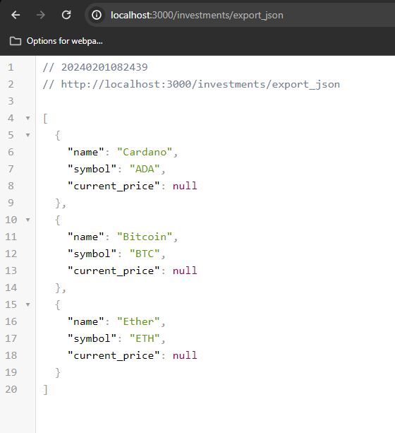
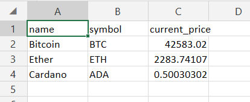

# Calculadora de Inversiones de Criptomonedas

Descubre el potencial de tus inversiones en criptomonedas con esta Calculadora de Inversiones de Criptomonedas. Con la capacidad única de gestionar inversiones en tres criptomonedas diferentes, podrás seguir de cerca el rendimiento anual en dólares y en la propia criptomoneda.

Características destacadas:

Diversificación de Inversiones: Crea nuevas inversiones en Bitcoin, Ethereum y Ripple, y visualiza fácilmente su desempeño individual.
Retorno Anual Detallado: Obtén informes detallados del retorno anual, tanto en moneda fiduciaria como en la criptomoneda seleccionada.
Tabla en Tiempo Real: Explora una tabla en tiempo real en la página principal, mostrando los valores actualizados de las tres criptomonedas para tomar decisiones informadas.
Exportación de Datos: Simplifica tu análisis exportando la información de la tabla en formatos JSON o CSV.

Caracteristicas Técnicas:

La aplicación hace uso de la API de coinbase en la cual establece conexion por medio de websockets con actionCable en ruby on rails para la visualización de la información de la table de las criptomonedas en tiempo real.
Lee información de archivo csv para usarla como base para mostrarla en la pantalla.
Hace llamadas a la API para obtener el valor de cada criptomoneda en Dolares
Valida desde el frontend y backend los inputs de información del usuario, en este caso solo la cryptocurrency y el amount de la inversión.


## Requisitos

- Ruby 2.7.6
- Ruby on Rails 6.0.7
- PostgreSQL 12


## Instalacion

Clonar el repositorio https://github.com/JulianRodriguez29/crypto_investment_calculator.git

Una vez que tenga la copia, ejecute los siguientes comandos dentro del directorio:

Ejecute la instalación del paquete para instalar todas las gemas del proyecto. 
```bash
  bundle:install
```
Configure el nombre de usuario y la contraseña en config/database.yml. 

Ejecute los siguientes comandos para crear las bases de datos, ejecute las migraciones iniciales. 
```bash
  rails db:create
  rails db:migrate
```

Inicie la aplicación con uno de los siguientes comandos.
```bash
  rails server
  rails s
```


Ejecute el siguiente comando  para habilitar la recarga en vivo. 
```bash
  bin/webpack-dev-server
```
Vaya a su servidor local http://127.0.0.1:3000
    
## Screenshots

Algunos screenshots del proyecto









